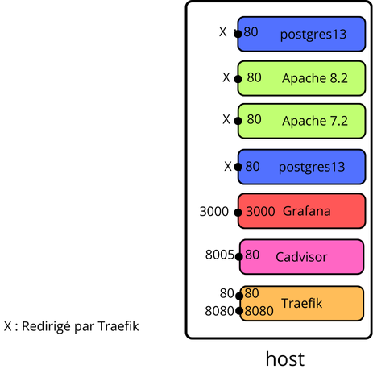
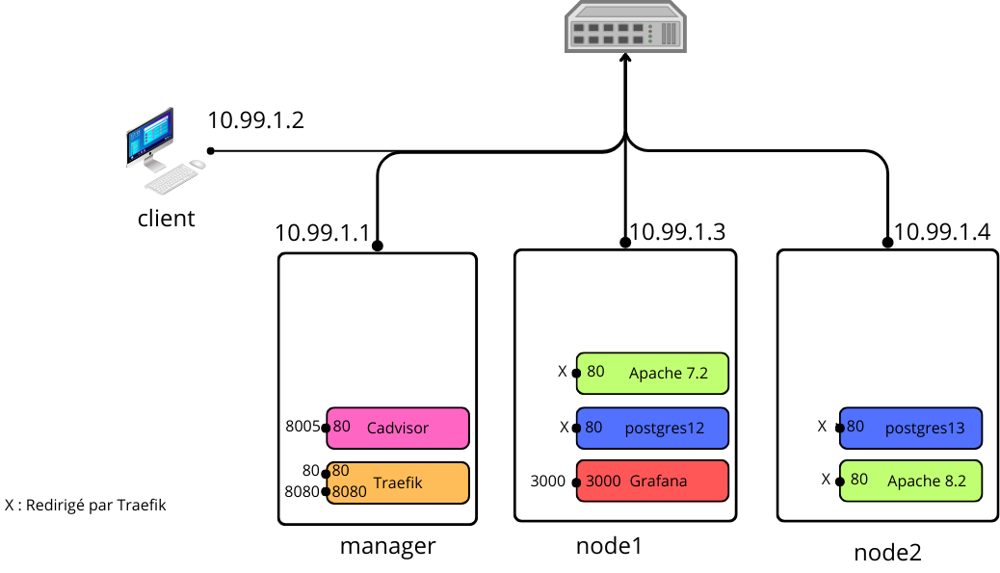

# Documentation

## Architecture

#### Figure 1 - Architecture mono-machine

#### Figure 2 - Architecture cluster

## Scripts

### init-manager.sh

Lancer le script : `./init-manager.sh` 

Quitter une fois les nodes connectées.

### init-node.sh

#### manuel
Récupérez les informations du manager.
Lancer le script : `./init-node.sh [TOKEN du manager] [IP HOST] [PORT]`

#### automatic

Lancer le script : `./init-node.sh`